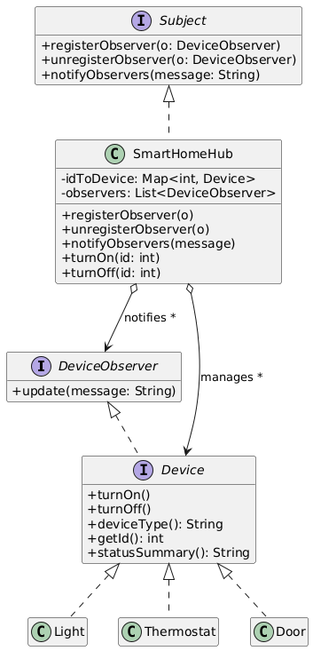
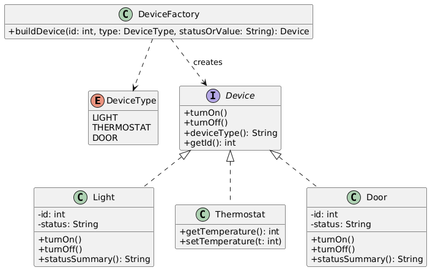
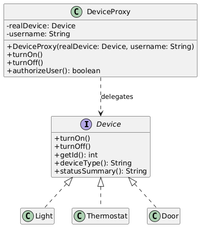
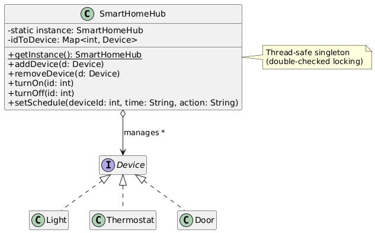
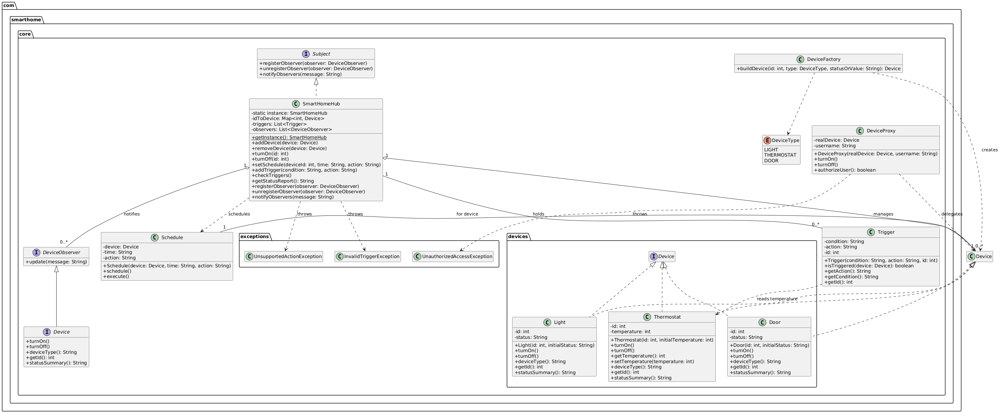

# Smart Home System

## Introduction

The Smart Home System is a Java-based application that simulates a smart home system, allowing us to control various smart devices such as lights, thermostats, and door locks via a central hub. Users can set schedules, automate tasks, view device status & reports, and manage triggers.

This project serves as a comprehensive demonstration of several software design patterns implemented in Java. It aims to provide a clear and concise understanding of how these design patterns can be applied to real-world scenarios, showcasing their benefits and practical usage.

## Design Patterns Implemented

1. **Behavioral Patterns**:
   - **Observer Pattern**: `SmartHomeHub` implements `Subject` to notify `DeviceObserver` subscribers on state changes.
     - Implemented in: `com.smarthome.core`
     - Use case: Smart Home device status notifications (e.g., broadcasting on/off, lock/unlock, temperature changes)

    

2. **Creational Patterns**:
   - **Factory Method Pattern**: `DeviceFactory` creates typed devices using the `DeviceType` enum.
     - Implemented in: `com.smarthome.core`
     - Use case: Provisioning smart devices (Light, Thermostat, Door) with validated initial state

    

3. **Structural Patterns**:
   - **Proxy Pattern**: `DeviceProxy` performs simple authorization checks before delegating to real `Device` implementations.
     - Implemented in: `com.smarthome.core`
     - Use case: Access control for device operations via a protection proxy

    

4. **Singleton Pattern**:
   - `SmartHomeHub` is a thread-safe singleton (double-checked locking) providing a single point of coordination.
     - Implemented in: `com.smarthome.core`
     - Use case: Central hub as the single source of truth and coordinator

    

## Features

- Device control: turn on/off lights, lock/unlock doors, adjust thermostat temperature
- Dynamic device management: add/remove devices at runtime via the hub
- Scheduling: execute actions at specified times (with daily wrap-around)
- Automation: simple triggers based on device properties (e.g., thermostat temperature)
- Observer notifications to subscribed listeners
- Access control proxy for secure device operations

## Getting Started (JDK only, no Maven)

Prerequisites: Java 17+ (JDK)

1. Clone the repository:
   ```
   git clone <repository-url>
   ```
2. Navigate to the project directory:
   ```
   cd Smart-Home-System
   ```
3. Compile the Java files:
   - Windows (PowerShell):
     ```
     mkdir out
     dir /s /b src\main\java\*.java > sources.txt
     javac --% -encoding UTF-8 -d out @sources.txt
     ```
   - macOS/Linux (bash):
     ```
     mkdir -p out
     javac -encoding UTF-8 -d out $(find src/main/java -name "*.java")
     ```
4. Run the main class:
   ```
   java -cp out com.smarthome.core.Main
   ```

## Usage

Use the `SmartHomeHub` to register and control devices, set schedules, and define simple triggers.
Actions accept friendly strings like "Turn On"/"Turn Off" (also "on"/"off"); they are normalized internally.

```java
SmartHomeHub hub = SmartHomeHub.getInstance();
Device light = DeviceFactory.buildDevice(1, DeviceType.LIGHT, "off");
Device thermostat = DeviceFactory.buildDevice(2, DeviceType.THERMOSTAT, "72");
Device door = DeviceFactory.buildDevice(3, DeviceType.DOOR, "locked");

hub.addDevice(light);
hub.addDevice(thermostat);
hub.addDevice(door);

hub.turnOn(1);
hub.setSchedule(2, "06:00", "Turn On");
hub.addTrigger("temperature > 70", "turnOff(1)");
System.out.println(hub.getStatusReport());
```

Example status output:
```
Light 1 is On.
Thermostat is set to 72 degrees.
Door 3 is Locked.
```

## Architecture



```
Smart Home System/
  ├─ pom.xml
  ├─ README.md
  └─ src/
     ├─ main/
     │  └─ java/
     │     └─ com/smarthome/core/
     │        ├─ Main.java
     │        ├─ SmartHomeHub.java
     │        ├─ Device.java
     │        ├─ DeviceType.java
     │        ├─ DeviceFactory.java
     │        ├─ DeviceProxy.java
     │        ├─ Subject.java
     │        ├─ DeviceObserver.java
     │        ├─ Trigger.java
     │        ├─ Schedule.java
     │        ├─ devices/
     │        │  ├─ Light.java
     │        │  ├─ Thermostat.java
     │        │  └─ Door.java
     │        └─ exceptions/
     │           ├─ InvalidTriggerException.java
     │           ├─ UnauthorizedAccessException.java
     │           └─ UnsupportedActionException.java
     └─ test/
        └─ java/
           └─ com/smarthome/core/
              └─ SmartHomeHubTest.java
```

## Improvements Over Originals

- Proper singleton for `SmartHomeHub` (private constructor, thread-safe access)
- Enum-based device types (`DeviceType`) to avoid string errors
- Subject/Observer interfaces for decoupled notifications
- Polymorphism: hub delegates to devices; no `instanceof` chains
- Input validation and consistent exception handling
- `ScheduledExecutorService` replaces raw `Timer`/`TimerTask`
- Consolidated, comprehensive README and Javadoc

## Notes & Future Work

- Extend `Trigger` to support more device properties and compound conditions
- Add persistence for schedules and device states
- Replace simple proxy with role-based access control
- Build a REST API and/or UI for remote control

## License

This project is provided as an educational, production-ready foundation. Adjust licensing per your organization’s standards.


