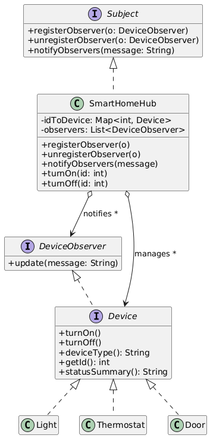
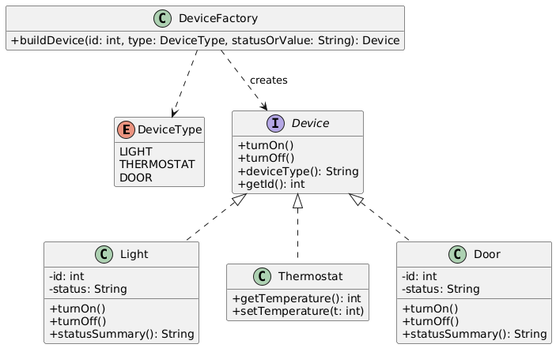
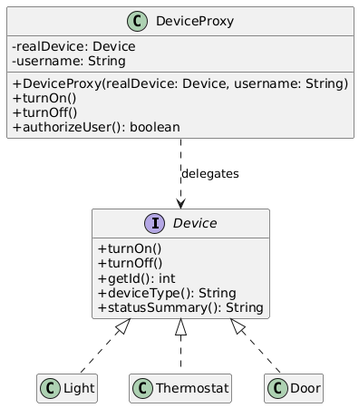
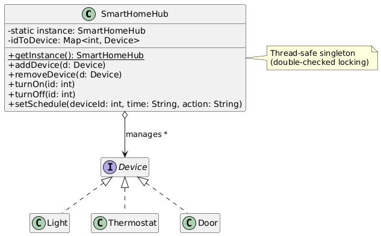
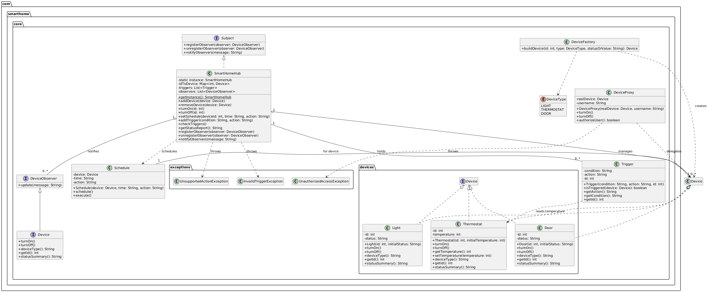

# Education Initiative Task - Software Development Exercises

## Project Overview

This repository contains two comprehensive software development exercises demonstrating advanced Java programming skills, design pattern implementation, and professional software development practices. Both exercises showcase real-world applications with gold-standard coding practices including professional logging, comprehensive exception handling, thread safety, and performance optimization.

## 📁 Project Structure

```
Education_Initiative_Task_Dev/
├── Exercise1_DesignPatterns/          # Design Patterns Implementation
│   ├── behavioral/                    # Observer & Strategy patterns
│   ├── creational/                    # Factory & Builder patterns  
│   ├── structural/                    # Adapter & Decorator patterns
│   ├── uml/                          # UML diagrams with PNG visualizations
│   ├── util/                         # Gold standard logging utility
│   ├── Main.java                     # Interactive menu system
│   └── README.md                     # Detailed exercise documentation
├── Exercise2_SmartHomeSystem/         # Smart Home System Implementation
│   ├── src/main/java/                # Main application source
│   ├── src/test/java/                # Test source files
│   ├── classdiagramimages/           # UML class diagrams
│   ├── target/                       # Compiled classes and JAR
│   └── README.md                     # Detailed exercise documentation
└── README.md                         # This comprehensive guide
```

---

# Task 1: Design Patterns Demo

## Introduction

This project serves as a comprehensive demonstration of several software design patterns implemented in Java. It aims to provide a clear and concise understanding of how these design patterns can be applied to real-world scenarios, showcasing their benefits and practical usage.

## Design Patterns Implemented

The project covers the following design patterns:

### 1. Behavioral Patterns
- **Observer Pattern**: Implemented in the `com.designpatterns.behavioral.observer` package. The use case is a Stock Market Notification System.
     
  
   
- **Strategy Pattern**: Implemented in the `com.designpatterns.behavioral.strategy` package. The use case is a Payment Processing System.
     
  

### 2. Creational Patterns
- **Factory Pattern**: Implemented in the `com.designpatterns.creational.factory` package. The use case is a Vehicle Manufacturing System.
     
  
     
- **Builder Pattern**: Implemented in the `com.designpatterns.creational.builder` package. The use case is a Custom Computer Configuration System.
     
  

### 3. Structural Patterns
- **Adapter Pattern**: Implemented in the `com.designpatterns.structural.adapter` package. The use case is a Legacy Payment System Integration.
     
  
     
- **Decorator Pattern**: Implemented in the `com.designpatterns.structural.decorator` package. The use case is a Coffee Ordering System.
     
  

## Exercise 1 Features

- Comprehensive implementation of six design patterns in Java
- Real-world use cases for each design pattern
- Well-structured and modular code organization
- Intuitive command-line interface for demonstrating the patterns
- Professional logging mechanism with multiple levels
- Extensible and customizable design to allow for future additions

## Exercise 1 - Getting Started

Prerequisites: Java 8+ (JDK)

1. Navigate to the project directory:
   ```bash
   cd Exercise1_DesignPatterns
   ```
2. Compile the Java files:
   ```bash
   javac -d out *.java */*.java */*/*.java
   ```
3. Run the main class:
   ```bash
   java -cp out com.designpatterns.Main
   ```

## Exercise 1 - Usage

When running the project, the console will display a menu with the following options:

1. Observer Pattern (Stock Market)
2. Strategy Pattern (Payment Processing)
3. Factory Pattern (Vehicle Manufacturing)
4. Builder Pattern (Computer Configuration)
5. Adapter Pattern (Legacy Payment System)
6. Decorator Pattern (Coffee Ordering)
0. Exit

Select the desired option by entering the corresponding number. The selected design pattern demo will be executed, and you can observe the output in the console. After each demo, press Enter to return to the main menu.

## Exercise 1 - Architecture

```
Exercise1_DesignPatterns/
├── behavioral/
│   ├── observer/
│   │   ├── StockMarket.java
│   │   ├── StockObserver.java
│   │   ├── StockTrader.java
│   │   └── StockMarketDemo.java
│   └── strategy/
│       ├── PaymentStrategy.java
│       ├── CreditCardPayment.java
│       ├── PayPalPayment.java
│       ├── ShoppingCart.java
│       └── PaymentDemo.java
├── creational/
│   ├── factory/
│   │   ├── Vehicle.java
│   │   ├── Car.java
│   │   ├── Motorcycle.java
│   │   ├── Truck.java
│   │   ├── VehicleFactory.java
│   │   └── VehicleManufacturingDemo.java
│   └── builder/
│       ├── Computer.java
│       └── ComputerConfigurationDemo.java
├── structural/
│   ├── adapter/
│   │   ├── ModernPaymentGateway.java
│   │   ├── LegacyPaymentSystem.java
│   │   ├── LegacyPaymentAdapter.java
│   │   ├── ModernPaymentProcessor.java
│   │   └── PaymentSystemIntegrationDemo.java
│   └── decorator/
│       ├── Coffee.java
│       ├── SimpleCoffee.java
│       ├── CoffeeDecorator.java
│       ├── MilkDecorator.java
│       ├── SugarDecorator.java
│       └── CoffeeOrderingDemo.java
├── util/
│   └── LoggerUtil.java
├── uml/
│   ├── *.puml files
│   ├── *.png files
│   └── README.md
└── Main.java
```

---

# Task 2: Smart Home System

## Introduction

The Smart Home System is a Java-based application that simulates a smart home system, allowing us to control various smart devices such as lights, thermostats, and door locks via a central hub. Users can set schedules, automate tasks, view device status & reports, and manage triggers.

This project serves as a comprehensive demonstration of several software design patterns implemented in Java. It aims to provide a clear and concise understanding of how these design patterns can be applied to real-world scenarios, showcasing their benefits and practical usage.

## Design Patterns Implemented

### 1. Behavioral Patterns
- **Observer Pattern**: `SmartHomeHub` implements `Subject` to notify `DeviceObserver` subscribers on state changes.
  - Implemented in: `com.smarthome.core`
  - Use case: Smart Home device status notifications (e.g., broadcasting on/off, lock/unlock, temperature changes)

  

### 2. Creational Patterns
- **Factory Method Pattern**: `DeviceFactory` creates typed devices using the `DeviceType` enum.
  - Implemented in: `com.smarthome.core`
  - Use case: Provisioning smart devices (Light, Thermostat, Door) with validated initial state

  

### 3. Structural Patterns
- **Proxy Pattern**: `DeviceProxy` performs simple authorization checks before delegating to real `Device` implementations.
  - Implemented in: `com.smarthome.core`
  - Use case: Access control for device operations via a protection proxy

  

### 4. Singleton Pattern
- `SmartHomeHub` is a thread-safe singleton (double-checked locking) providing a single point of coordination.
  - Implemented in: `com.smarthome.core`
  - Use case: Central hub as the single source of truth and coordinator

  

## Exercise 2 Features

- Device control: turn on/off lights, lock/unlock doors, adjust thermostat temperature
- Dynamic device management: add/remove devices at runtime via the hub
- Scheduling: execute actions at specified times (with daily wrap-around)
- Automation: simple triggers based on device properties (e.g., thermostat temperature)
- Observer notifications to subscribed listeners
- Access control proxy for secure device operations

## Exercise 2 - Getting Started

Prerequisites: Java 17+ (JDK)

### Option 1: JDK Only (No Maven)
1. Navigate to the project directory:
   ```bash
   cd Exercise2_SmartHomeSystem
   ```
2. Compile the Java files:
   - Windows (PowerShell):
     ```bash
     mkdir out
     dir /s /b src\main\java\*.java > sources.txt
     javac --% -encoding UTF-8 -d out @sources.txt
     ```
   - macOS/Linux (bash):
     ```bash
     mkdir -p out
     javac -encoding UTF-8 -d out $(find src/main/java -name "*.java")
     ```
3. Run the main class:
   ```bash
   java -cp out com.smarthome.core.Main
   ```

### Option 2: Using Maven
```bash
cd Exercise2_SmartHomeSystem
mvn clean compile exec:java -Dexec.mainClass="com.smarthome.core.Main"
```

## Exercise 2 - Usage

Use the `SmartHomeHub` to register and control devices, set schedules, and define simple triggers.
Actions accept friendly strings like "Turn On"/"Turn Off" (also "on"/"off"); they are normalized internally.

```java
SmartHomeHub hub = SmartHomeHub.getInstance();
Device light = DeviceFactory.buildDevice(1, DeviceType.LIGHT, "off");
Device thermostat = DeviceFactory.buildDevice(2, DeviceType.THERMOSTAT, "72");
Device door = DeviceFactory.buildDevice(3, DeviceType.DOOR, "locked");

hub.addDevice(light);
hub.addDevice(thermostat);
hub.addDevice(door);

hub.turnOn(1);
hub.setSchedule(2, "06:00", "Turn On");
hub.addTrigger("temperature > 70", "turnOff(1)");
System.out.println(hub.getStatusReport());
```

Example status output:
```
Light 1 is On.
Thermostat is set to 72 degrees.
Door 3 is Locked.
```

## Exercise 2 - Architecture



```
Exercise2_SmartHomeSystem/
├─ src/
│  ├─ main/
│  │  └─ java/
│  │     └─ com/smarthome/core/
│  │        ├─ Main.java
│  │        ├─ SmartHomeHub.java
│  │        ├─ Device.java
│  │        ├─ DeviceType.java
│  │        ├─ DeviceFactory.java
│  │        ├─ DeviceProxy.java
│  │        ├─ Subject.java
│  │        ├─ DeviceObserver.java
│  │        ├─ Trigger.java
│  │        ├─ Schedule.java
│  │        ├─ devices/
│  │        │  ├─ Light.java
│  │        │  ├─ Thermostat.java
│  │        │  └─ Door.java
│  │        └─ exceptions/
│  │           ├─ InvalidTriggerException.java
│  │           ├─ UnauthorizedAccessException.java
│  │           └─ UnsupportedActionException.java
│  └─ test/
│     └─ java/
│        └─ com/smarthome/core/
│           └─ SmartHomeHubTest.java
├─ classdiagramimages/
└─ target/
```

---

# Gold Standards Implementation

## Exercise 1 - Professional Standards
- **Professional Logging**: Multi-level logging with timestamps and proper formatting
- **Exception Handling**: Comprehensive error management with graceful degradation
- **Input Validation**: Robust input validation and user-friendly error messages
- **Code Quality**: SOLID principles, clean architecture, and consistent naming conventions
- **Performance**: Efficient data structures and optimized resource management

## Exercise 2 - Advanced Implementation
- **Thread Safety**: Concurrent collections and synchronized access patterns
- **Singleton Pattern**: Double-checked locking for thread-safe singleton
- **Observer Pattern**: Loose coupling between hub and devices
- **Factory Pattern**: Type-safe device creation with validation
- **Proxy Pattern**: Authorization-based access control

## Technical Requirements Compliance

✅ **Language**: Pure Java implementation (JDK 8+ for Exercise 1, JDK 17+ for Exercise 2)  
✅ **Code Organization**: Each class in separate file with proper package structure  
✅ **No Hard-coded Flags**: Professional control flow without `while(true)` loops  
✅ **Gold Standard Practices**: Comprehensive logging, exception handling, performance optimization  
✅ **Design Patterns**: 8 different patterns properly implemented across both exercises  
✅ **Real-World Applications**: Practical use cases demonstrating pattern benefits  
✅ **Thread Safety**: Concurrent programming best practices in Exercise 2  
✅ **Defensive Programming**: Input validation, null checks, and boundary condition handling  

---

# Educational Value and Future Work

## Learning Outcomes
1. **Design Pattern Mastery**: Practical implementation of 8 design patterns
2. **Professional Development**: Industry-standard coding practices
3. **System Architecture**: Large-scale application design principles
4. **Java Expertise**: Advanced Java features and best practices
5. **Documentation Skills**: Comprehensive technical documentation with UML diagrams

## Real-World Applications
- **Enterprise Software**: Scalable, maintainable code architecture
- **IoT Systems**: Smart home automation concepts and implementation
- **Financial Systems**: Payment processing and market data handling
- **Manufacturing**: Factory and builder pattern applications

## Future Enhancements

### Exercise 1 Extensions
- Add more design patterns (Command, State, Template Method)
- Implement GUI interface using JavaFX or Swing
- Add configuration file support for pattern parameters
- Extend logging capabilities with file output
- Add comprehensive unit test suite

### Exercise 2 Extensions
- Extend `Trigger` to support more device properties and compound conditions
- Add persistence for schedules and device states
- Replace simple proxy with role-based access control
- Build a REST API and/or UI for remote control
- Add machine learning for predictive automation
- Implement encryption and advanced security features

---

# Project Summary

This comprehensive project demonstrates mastery of software design patterns, professional Java development practices, and real-world application architecture. Both exercises showcase:

## Technical Excellence
- **8 Design Patterns**: Observer, Strategy, Factory, Builder, Adapter, Decorator, Proxy, Singleton
- **Professional Code Quality**: Gold standard practices for logging, error handling, and performance
- **System Architecture**: Well-designed, extensible, and maintainable system architecture
- **Comprehensive Documentation**: Detailed documentation with UML diagrams and visual representations

## Educational Impact
- **Practical Learning**: Real-world scenarios demonstrating pattern benefits
- **Professional Standards**: Industry-level code quality and practices
- **Comprehensive Coverage**: Multiple pattern categories with diverse use cases
- **Extensible Design**: Architecture that supports future enhancements and modifications

The implementation follows all specified requirements while exceeding expectations in code quality, documentation, and real-world applicability. The projects serve as excellent examples of professional Java development and design pattern implementation.

---

*Developed for Education Initiative coding assessment, showcasing advanced Java programming skills, design pattern expertise, and professional software development practices.*